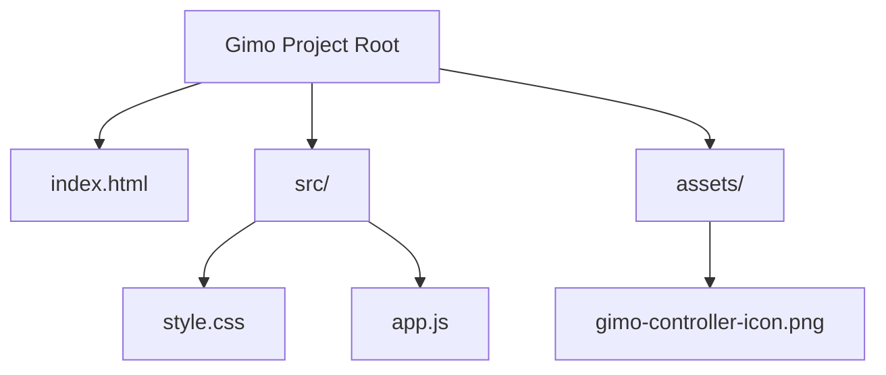

<!-- Title & Subtitle -->
<div align="center">
  <h1 style="font-weight: 900; font-size: 48px; margin-bottom: 0;"><b>GIMO - Game Vault</b></h1>
  <p style="font-size: 18px; color: #94A3B8; margin-top: 4px; font-weight: 600;">Store. Organize. Play.</p>
</div>

<!-- Sliding SVG Animated Divider -->
<div align="center">
  <svg xmlns="http://www.w3.org/2000/svg" viewBox="0 0 800 12" width="100%" height="12">
    <style>
      .animated-divider {
        stroke: url(#dividerGrad);
        stroke-width: 4;
        stroke-dasharray: 15, 12;
        animation: march 2.5s linear infinite;
      }
      @keyframes march {
        to { stroke-dashoffset: -54; }
      }
    </style>
    <defs>
      <linearGradient id="dividerGrad" x1="0%" y1="0%" x2="100%" y2="0%">
        <stop offset="0%" stop-color="#d6c2c5" />
        <stop offset="50%" stop-color="#FFB300" />
        <stop offset="100%" stop-color="#FE4A60" />
      </linearGradient>
    </defs>
    <line x1="0" y1="6" x2="800" y2="6" class="animated-divider" />
  </svg>
</div>

<div align="center">
  
  [](#technology-stack)
  [](#)
  [](#design-aesthetics)
  
</div>

## Project Description

Gimo is a simple, beautiful, and secure local vault to save your gaming usernames, passwords, and accounts. It runs entirely on client-side storage, requires no external databases or servers, and stores all entries inside your browser cache.

Built with a bold, high-contrast dark theme (Neo-Brutalism), it turns into a convenient floating pill button on mobile views so you can copy, edit, or add credentials on the go with single taps.

---

## Key Features

| Feature | Description |
| :--- | :--- |
| **Clean Vault** | Organizes usernames, passwords, linked emails, email passwords, and notes. |
| **Platform Badges** | Supports Steam, Epic Games, Ubisoft, Xbox, and Rockstar tags with custom colors. |
| **Floating Action Button** | Relocates to the bottom-right corner on mobile view for easy thumb access. |
| **View Transitions** | Switch themes smoothly with a custom Shigure Ui Dance GIF transition mask. |
| **Dark Theme** | Sleek space black colors designed for visual comfort in low-light environments. |
| **Local Storage Sync** | Automatically saves and reads credentials from your browser with version tracking. |

---

## Architecture

The project is structured modularly for easy editing, production builds, and fast loading speeds:



* **`index.html`**: Core HTML5 markup containing the render-blocking theme detector.
* **`src/style.css`**: CSS stylesheet detailing layouts, animations, and custom media queries.
* **`src/app.js`**: Core controller containing rendering, storage sync, and clipboard functions.
* **`assets/`**: Static logo and cover banner image assets.

---

## Getting Started

No bundlers, dependencies, or build configurations required. Simply load the entry file locally:

```bash
# 1. Clone the project
git clone https://github.com/your-username/Gimo.git

# 2. Enter directory
cd Gimo

# 3. Serve local server or open index.html directly
python -m http.server 8000
```
Then visit `http://localhost:8000` inside your browser.

---

## License

This project is licensed under the MIT License - see the LICENSE file for details.

---